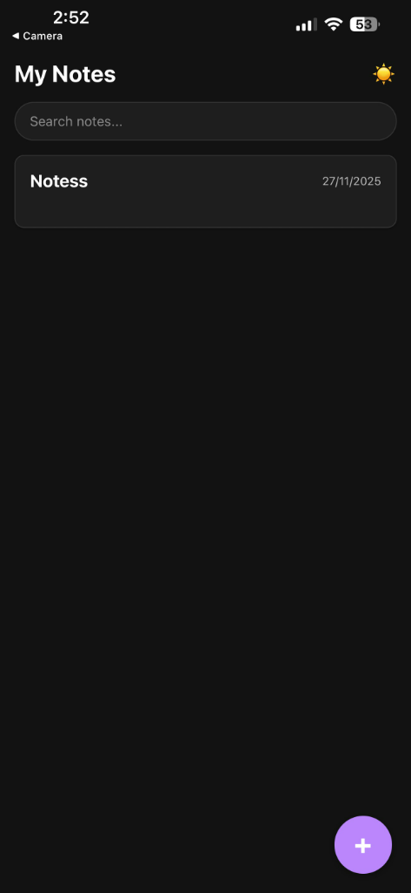
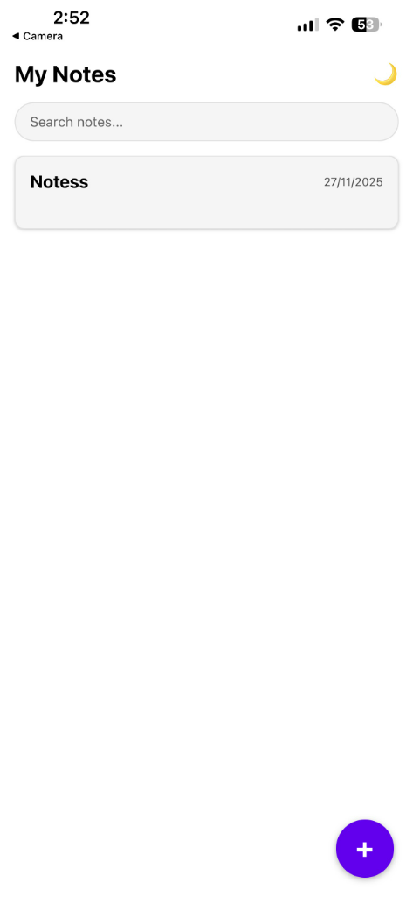
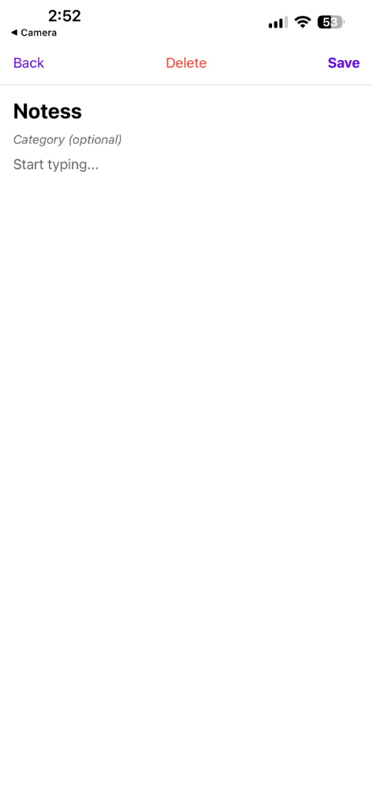
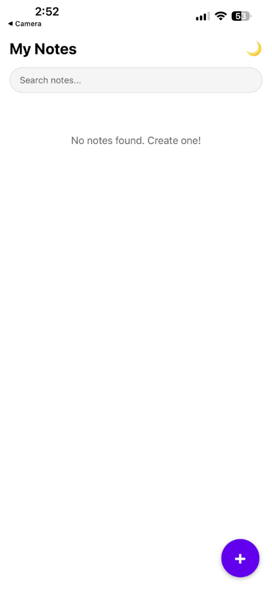

# Notes App 

A clean, modern Notes Application built with React Native and Expo. This app allows users to create, read, update, and delete notes with a beautiful dark/light mode interface.

## Features

- **Create Notes**: Easily add new notes with a title, content, and optional category.
- **Edit & Update**: Modify existing notes to keep your thoughts organized.
- **Delete Notes**: Remove notes you no longer need.
- **Search**: Quickly find notes by title, content, or category.
- **Local Storage**: All data is persisted locally using AsyncStorage.
- **Dark Mode**: Toggle between light and dark themes for a comfortable viewing experience.
- **Categories**: Organize your notes with optional categories.

## Screenshots

<div style="display: flex; flex-wrap: wrap; gap: 10px;">
  
  
  
  
</div>

## Tech Stack

- **React Native**: Cross-platform mobile application framework.
- **Expo**: Platform for making universal native apps.
- **AsyncStorage**: Unencrypted, asynchronous, persistent, key-value storage system.
- **React Navigation**: Routing and navigation for Expo and React Native apps.

## Getting Started

1.  **Clone the repository:**
    ```bash
    git clone <repository-url>
    cd Notes
    ```

2.  **Install dependencies:**
    ```bash
    npm install
    ```

3.  **Run the application:**
    ```bash
    npm start
    ```


